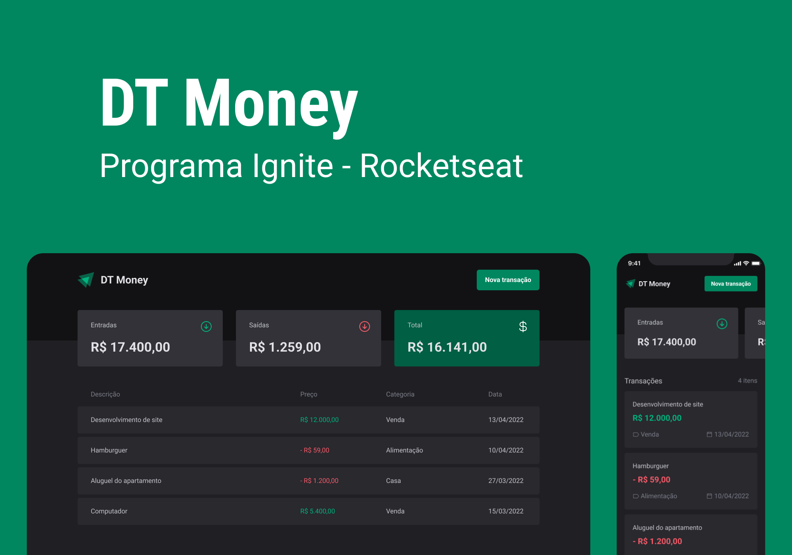

# DT money - API consumption and performance in React JS (Ignite)

<div>
  
  
  
</div>


> Project carried out during the classes of the 3st React JS module of Rocketseat Ignite
<br></br>

## 🧪 Technologies

This project was developed using the following technologies:

- [ReactJS](https://reactjs.org/)
- [TypeScript](https://www.typescriptlang.org/)
- [ViteJS](https://vitejs.dev/)
- [Styled Components](https://styled-components.com/)
- [Zod](https://zod.dev/)
- [React Hook form](https://react-hook-form.com/)
- [Eslint](https://eslint.org/)
- [Radix UI](https://www.radix-ui.com/)
- [Axios](https://axios-http.com/ptbr/docs/intro)
- [Json Server](https://github.com/typicode/json-server)

<br></br>

## 🚀 Getting started

Clone the project and access the folder.

```bash
$ git clone https://github.com/leticiar-io/dt-money-ignite.git
$ cd dt-money-ignite
```

Follow the steps below:

```bash
# Install the web dependencies
$ npm install
# Start the web project
$ npm run dev
```


[⬆ Back to top](#dt-money-ignite)<br>